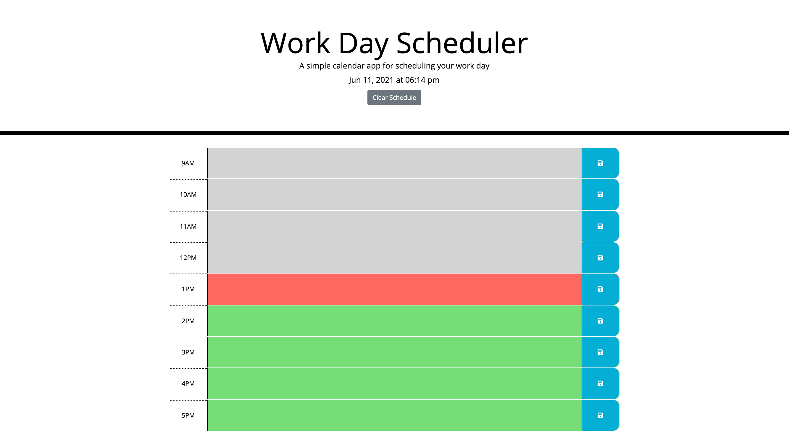

# Daily Event Planner

## A color coded planner that visually tracks the day flying by.

- In terms of personal challenge, this project challeneged me on a few concepts. It was my first time adapting the Moment.js library in a useful senario. It gave me a good refrence for the ways to display and control the data provided. This was also the first time I got to work through dynamic time-based class changes, as well as an upgrade in the amount of different local storage items to set up.

- This web app used HTML, CSS, Javascript, JQuery, Moment.JS, Bootstarp, Google Fonts, & Font Awesome.

- As far as usability, lets go through what this bad boy can do:

  - With a nice calming fade into the day, you're greeted with an up-to-date clock at the top keeping track of time every minute.
  - A work days worth of time plotted out below, with the ability to edit and insert tasks that you have finished or plan to finish thoughtout the day.
  - Those tasks can be saved on the page, and you can come and go from the page as you please with those tasks staying where you left them.
  - If you're done with the days tasks or wants a fresh start, a button under the clock lets you wipe clean and start again like a brand new day.

[Click Here](https://shaneconwell.github.io/daily-event-tracker/) to check out the app!

